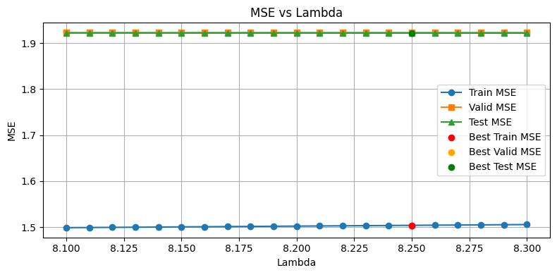

This repository contains the code for Assignment 2 of UCSD CSE 258 Web Mining and Recommender Systems.

We predict clothing ratings using Collaborative Filtering and Latent Factor Models on the RentTheRunway dataset from *Decomposing fit semantics for product size recommendation in metric spaces* by Rishabh Misra, Mengting Wan, and Julian McAuley (RecSys 2018).

Below are how the hyperparameters of latent factor model influences  MSE.

**Lambda Values from 1 to 10**

**Lambda Values from 8.1 to 8.3**

### Results:
| Method           | MSE      |
|------------------|----------|
| Baseline         | 2.0565   |
| Item-based CF    | 2.20295  |
| User-based CF    | 2.20519  |
| Latent Factor    | 1.92280  |

